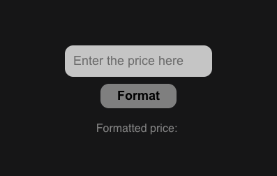

# Projeto React Custom Modal



This project is a easy way to format prices with intl

## Technologies Used

- **React**: JavaScript library for building user interfaces.
- **TypeScript**: A superset of JavaScript that adds static typing.
- **styled-components**: A library for styling components in React.

## Installation

1. Clone the repository:

   ```bash
   git clone <https://github.com/gabriellazaroni/react-custom-modal.git>

   ```

2. Install dependencies:

   ```bash
   npm install

   ```